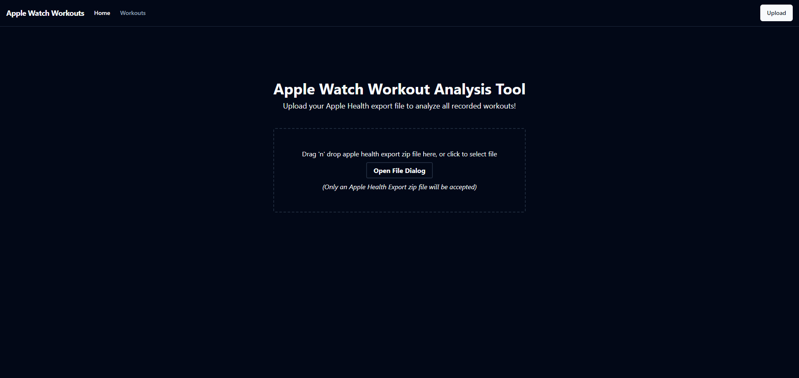
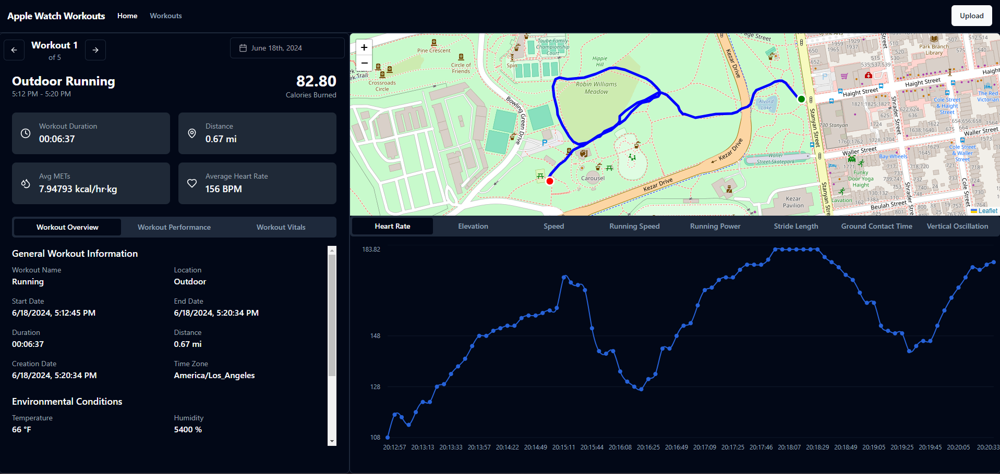
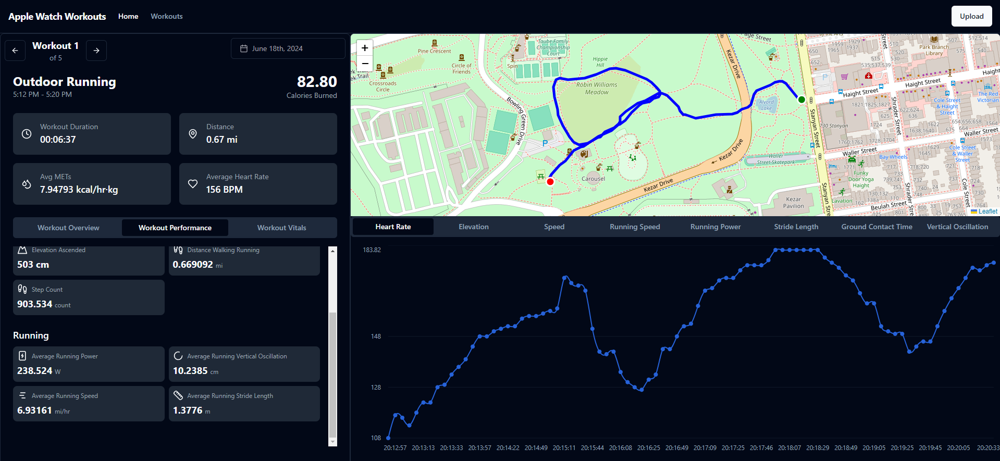

# Apple Watch Workout Analysis Tool

_Application designed to allow users to analyze their workouts captured by the Apple Watch_





## Tech Stack

- Vite (as the frontend framework)
- Shadcn / Tailwind (for styling the frontend)
- Python (for building the backend API and services)
- Pandas (for data analysis)

## Installation

1. **Clone the repository**:

   ```bash
   git clone https://github.com/Jdwalli/AppleWatchWorkouts.git
   ```

2. **Install backend dependencies using pip**:

   ```bash
   cd backend
   pip install -r requirements.txt
   ```

3. **Install frontend dependencies using npm**:

   ```bash
   cd frontend
   npm install
   ```

### Running the Application

- **Development Mode**:

  Build and run the application using npm:

  ```bash
  npm run dev
  ```
